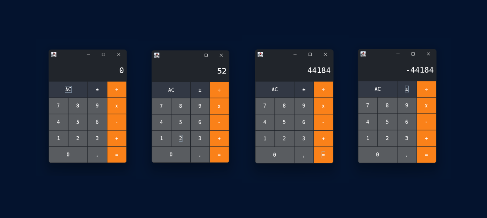

# Calculadora Java swing

Projeto de estudo para desenvolvimento de aplicações com interfaces GUI baseadas em swing. 
Essa calculadora foi inspirada na mesma dos sistemas da Apple.

Nesse projeto foi utilizado:

- Design patterns
  - Singleton
  - Observer
- Gerenciadores de Layout - (*swing*)
  - GridBagLayout - (*no teclado*)
    - GridBagConstraints
  - BorderLayout - (*na calculadora*)
  - FlowLayout - (*no display*)
- JPanel
- JFrame
- JLabel
- JButton
- Java Básico
  - Condicionais
  - Operações matemáticas
  - Enumerables
  - List
  - ArrayList
  - Operador Ternário
  - ForEach
  - Lambdas expressions
  - Métodos da classe String
    - replace
    - equals
    - isEmpty
    - endsWith
    - contains
    - outros...
  - Métodos da Classe Double
    - parseDouble
