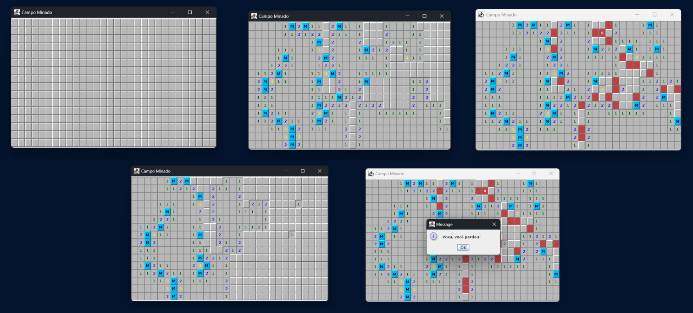

# Campo Minado Swing
Projeto com propósito de estudar e desenvolver uma aplicação Java com interface gráfica (Swing).
Utilizando como base o projeto anterior de campo minado desenvolvido em CLI para console (terminal).

Nesse projeto foram abordados conceitos como:

- Padrão Observer:
  - Utilizado para capturar eventos dentro do game e realizar determinadas ações na interface.
- (Swing)
  - MouseEvent
  - MouseListener
  - GridLayout
  - Colors
  - setTitle
  - setSize
  - setLocationRelativeTo
  - setVisible
  - JButton
  - JPanel
  - JFrame
  - setBackground
  - setText
  - setBorder
  - BorderFactory
  - etc
- (Java)
  - ArryList
  - Exceções customizadas
  - Streams (filter, allMatch, findFirst, map)
  - Lambdas (programação funcional)
  - Predicate
  - Iterator
  - Laços
  - StringBuilder 
  - Conceitos de POO
---

