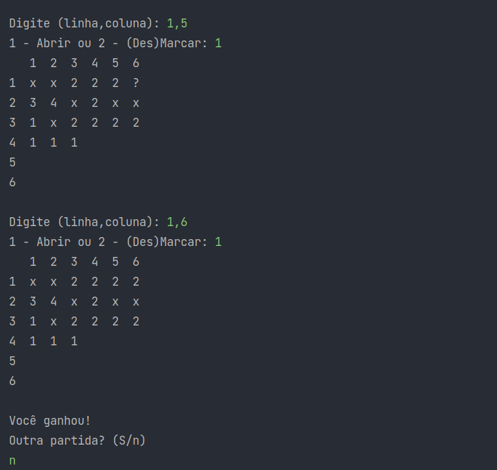

# Campo Minado
Projeto com objetivo de treinar e implementar conceitos estudados durate o curso de java.

Game foi desenvolvido em java e implementado em console nesse projeto foram abordados conceitos como:
- ArryList
- Exceções customizadas
- Streams (filter, allMatch, findFirst, map)
- Lambdas (programação funcional)
- Predicate
- Iterator
- Laços
- StringBuilder 
- Conceitos de POO
---

